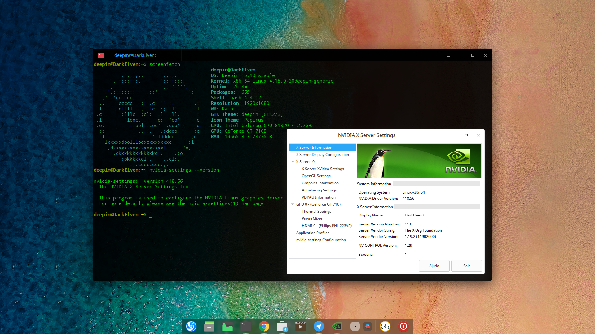

# **deepin-nvidia**

## nvidia-graphics-drivers-418.56-2~bpo9+1 para Linux Deepin Lion (15.10)


<a href="deepin-nvidia_418.56.png"  title="CLIQUE AQUI PARA AMPLIAR" alt="Deepin NVidia 418.56" ></a>

This is an **unofficial** repository for installing the NVidia Driver and its current version is 418.56

The source of some Debian ***Debian Stable + Stable Backports*** packages has been used, however, keeping all Deepin dependencies to be as stable as possible. Knowing that, you may preffer use the oficial driver offered to you by Deepin Developers when they ship this version of the driver via official repos. 

For those who want to test and use, you should add this key:

```
wget -qO - https://elppans.github.io/deepin-nvidia//public.key | sudo apt-key add -
```

And you should add the repository in your sources.list:

```
deb https://elppans.github.io/deepin-nvidia/ lion main contrib non-free
```

To list and remove an apt source key, use the following commands, respectively.

```
$ apt-key list
$ sudo apt-key del KEY.ID
```

Detailed information about the Graphic Driver:
https://www.nvidia.com.br/download/driverResults.aspx/145276/en


**Below, there is a list of all available packages:**

[NVidia packages available for Deepin Linux](https://elppans.github.io/deepin-nvidia/packages)


------


- Português:

Este é um repositório **NÃO OFICIAL** para a instalação do Driver NVidia e sua versão atual é 418.56

Foi usado o source de alguns pacotes do ***Debian Stable + Stable Backports***, porém, mantendo todas as dependências do Deepin, para que seja o mais estável possível. Por não ser um repositório oficial, ao sair a versão compilada pelo próprio time Deepin, prefira a mesma.

Para quem quer testar e usar, deve adicionar esta chave:

```
wget -qO - https://elppans.github.io/deepin-nvidia//public.key | sudo apt-key add -
```

E deve adicionar o repositório em seu sources.list:

```
deb https://elppans.github.io/deepin-nvidia/ lion main contrib non-free
```

Para listar e remover uma chave de fontes apt, use os seguintes comandos, respectivamente.

```
$ apt-key list
$ sudo apt-key del KEY.ID
```

Informações detalhadas sobre o Driver Gráfico:
[https://www.nvidia.com.br/download/driverResults.aspx/145276/br](https://www.nvidia.com.br/download/driverResults.aspx/145276/br)


**Abaixo está uma lista de todos os pacotes disponíveis:**

[Pacotes NVidia disponíveis para o Deepin Linux](https://elppans.github.io/deepin-nvidia/packages)
